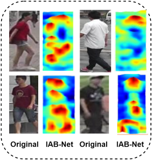
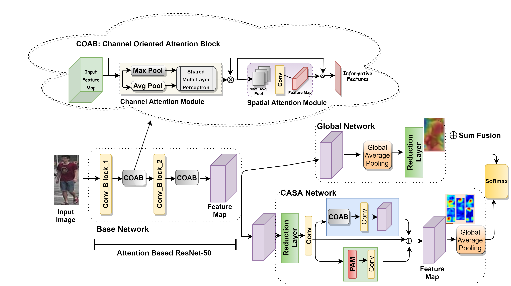
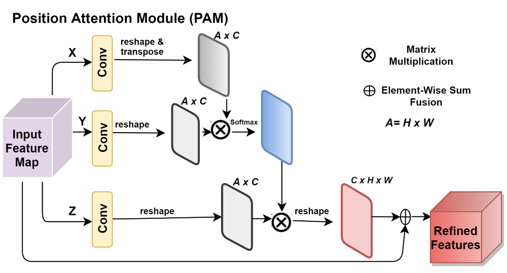
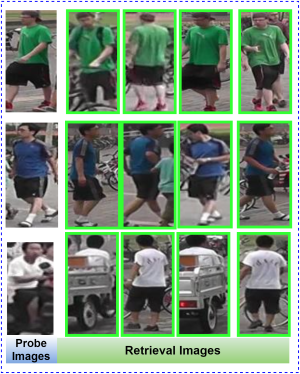

# IAB-Net: Informative and Attention Based Person Re-Identification

Rao Faizan, Muhammad Moazam Fraz

Refer to **Training Guides README** [here](./README_Training_and_Testing_Guides.md), original README [here](./README_ORIG.md), datasets README [here](./DATASETS.md).
We provide complete usage pretrained models for our paper.

- Market1501 [best IAB-Net model](https://www.dropbox.com/s/qccw2xd2zsz4cpk/Market-1501_checkpoint_best.pth.tar?dl=1)
- Duke [best IAB-Net model](https://www.dropbox.com/s/oslrheo8kzpjluf/DukeMTMC-ReID_checkpoint_best.pth.tar?dl=1)
- PRID-450s [best IAB-Net model](https://www.dropbox.com/s/ym3dhcqzkro66g2/PRID-450s_checkpoint_best.pth.tar?dl=1)

More models will come soon. If you want a pretrained model for some specific datasets, please be free to post an issue in our repo.

## Overview

The proposed framework IAB-Net is a multitask network
which further consist on two sub networks, namely Channel
and Spatial Attention (CASA) Net. The sub-network extracts
informative localized-body-parts before classification and generates
the Attentive Feature Map (AFM). The generated AFM
that provide more discriminatory and informative features
and plays more crucial role in classification. Global Network
intend to preserve global contextual information.

## Methods

Since ResNet is well known in re-id task, so the backbone
network of IAB-Net is based on ResNet architecture and after
adding attention mechanism in ResNet we named it Attention
Based ResNet-50 as shown in Fig 2. We have added COAB
on the output of each convolutional block of ResNet-50. After
generating informative feature map from base network, IABNet
split into a **global network** and **CASA network** in parallel.
In global network we applied global average pooling to
preserve global context information with most discriminative
features and then applied reduction layer (linear layer, batch
normalization, ReLU and dropout). CASA network further
splits in two different modules parallel. We applied reduction
layer on the output feature map of base network and after
applying the the convolution layer, we forward the output
to both modules. At the end, output of both network is
concatenated as the final feature map. Proposed network is
trained by using two loss function as hard mining triplet loss
along with cross entropy loss. 
Here are the detailed structure of PAM (Position Attention Module).

## Results

Our proposed IAB-Net achieves the state-of-the-art (SOTA) performance in Market-1501, DukeMTMC-Re-ID and PRID-450s datasets. The detailed comparison with previous SOTA can be found in [our paper](https://).

|    Dataset     | RANK-1 |  mAP  |
| :------------: | :---:  | :---: |
|  Market-1501   | 89.88  | 75.85 |
| DukeMTMC-Re-ID | 79.20  | 64.04 |
|  PRID-450s     | 37.33  | 53.40 |

## Citation

If you use this code for your research, please cite our paper.

